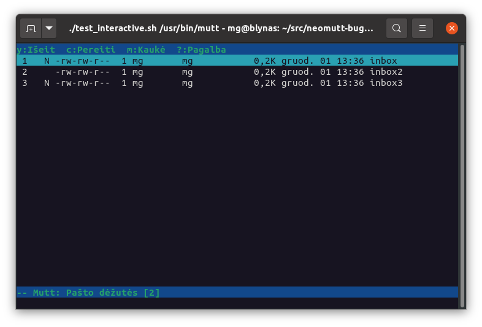

Reproduction for https://github.com/neomutt/neomutt/issues/2740

Run `./test.sh` and watch the exit code.  0 means everything's fine (neomutt
found new mail), 1 indicates failure (neomutt thought no mailboxes contain new
mail).

You can test against a specific mutt/neomutt binary with
`./test.sh /usr/bin/mutt`.

There's also an interactive version of the script.  If you run
`./test_interactive.sh`, this is what you should see: **N** flags next to two
out of three mailboxes.

